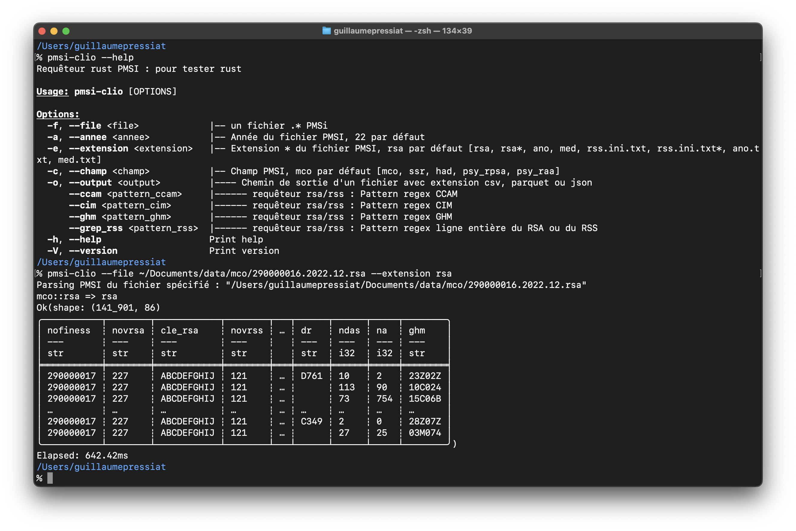

# pmsi-io 

pmsi::io : un logiciel pour lire les in/out du PMSi et les exporter en csv, xlsx, txt, json et parquet

Voir la page de présentation [ici](https://guillaumepressiat.github.io/blog/2024/04/pmsi-io).

Une vidéo est disponible ici : 

[https://www.youtube.com/watch?v=sDyYsXLEjx4](https://www.youtube.com/watch?v=sDyYsXLEjx4)

## Installation / mises à jour

L'application est disponible pour Windows, Ubuntu et Mac.

Télécharger l'application ici

- [Mac Silicon](https://github.com/GuillaumePressiat/pmsi-io/releases/download/v0.2.0/pmsi-io_0.2.0_aarch64.dmg) &bull;&bull;&bull; [Mac Intel](https://github.com/GuillaumePressiat/pmsi-io/releases/download/v0.2.0/pmsi-io_0.2.0_x64.dmg) &bull;&bull;&bull; [Mac Universal](https://github.com/GuillaumePressiat/pmsi-io/releases/download/v0.2.0/pmsi-io_0.2.0_universal.dmg)
- [Windows exe](https://github.com/GuillaumePressiat/pmsi-io/releases/download/v0.2.0/pmsi-io_0.2.0_x64-setup.exe) &bull;&bull;&bull; [Windows msi](https://github.com/GuillaumePressiat/pmsi-io/releases/download/v0.2.0/pmsi-io_0.2.0_x64_fr-FR.msi)
- [Ubuntu deb](https://github.com/GuillaumePressiat/pmsi-io/releases/download/v0.2.0/pmsi-io_0.2.0_amd64.deb) &bull;&bull;&bull; [Ubuntu AppImage](https://github.com/GuillaumePressiat/pmsi-io/releases/download/v0.2.0/pmsi-io_0.2.0_amd64.AppImage) &bull;&bull;&bull; [Linux RPM](https://github.com/GuillaumePressiat/pmsi-io/releases/download/v0.2.0/pmsi-io-0.2.0-1.x86_64.rpm)

Lancer l'installation en fonction du système d'exploitation.

### Sur mac

Si l'application ne s'ouvre pas, cela peut venir de la sécurité Apple (GateKeeper).
L'application pmsi-io n'est pas signée auprès d'apple (coût de 99€/an pour le développeur).

Vous pouvez tout de même choisir d'installer l'application en suivant ces étapes.

- Ouvrir les Réglages Systèmes et aller dans la rubrique Confidentialité et Sécurité.
- En bas de cet écran, autoriser l'application pmsi-io.app 

### Sur Windows

Si Windows Smartscreen empêche l'installation de l'application, vous pouvez suivre ces étapes.

- clic droit sur pmsi-io-xxx.exe
- Propriétés
- Cocher Débloquer (si débloquer n'est pas coché)

# pmsi-clio

pmsi-clio : un logiciel en ligne de commande (CLI) pour lire les in/out du PMSi et les exporter en csv, xlsx, txt, json et parquet

## Installation

L'outil en CLI est disponible pour Windows, Ubuntu et Mac.

Voir [ici](https://github.com/GuillaumePressiat/pmsi-io/releases/tag/v.0.2.0).

Ajouter éventuellement pmsi-clio dans le PATH.

# pmsi_rust

Ces deux développements reposent sur la librairie [pmsi_rust](https://guillaumepressiat.github.io/docr_pmsi/pmsi_rust/index.html).

Me contacter pour en savoir plus.

