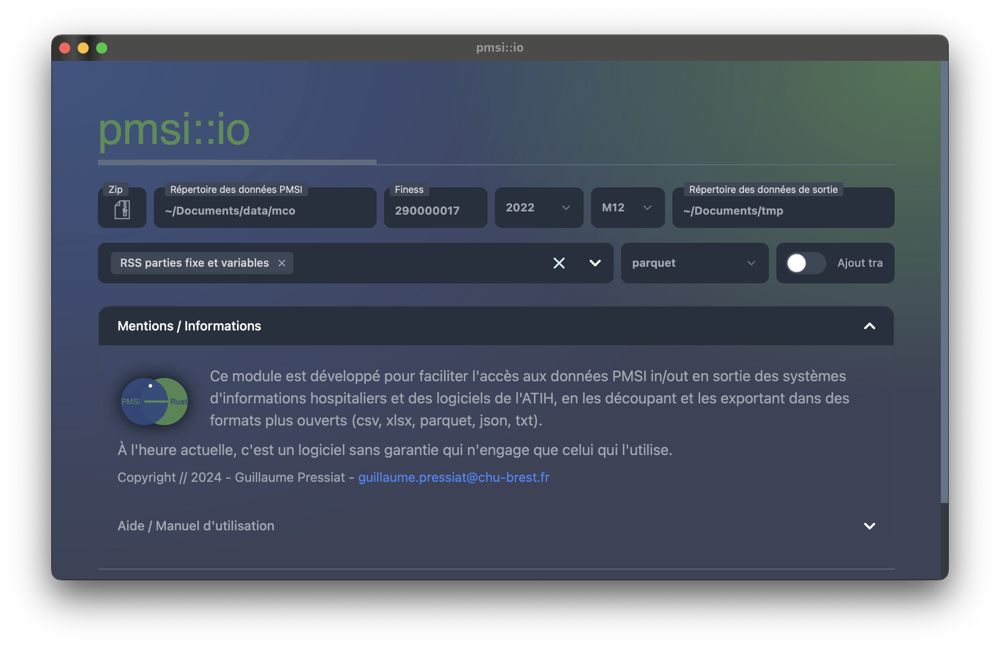

# pmsi-io

pmsi::io : un logiciel pour lire les in/out du PMSi et les exporter en csv, xlsx, txt, json et parquet

Voir la page de présentation [ici](https://guillaumepressiat.github.io/blog/2024/04/pmsi-io).

Une vidéo est disponible ici : 

[https://www.youtube.com/watch?v=sDyYsXLEjx4](https://www.youtube.com/watch?v=sDyYsXLEjx4)

## Installation

L'application est disponible pour Windows, Ubuntu et Mac.

Télécharger l'application ici

- [Mac Silicon](https://github.com/GuillaumePressiat/pmsi-io/releases/download/v0.1.8/pmsi-io_0.1.8_aarch64.dmg) &bull;&bull;&bull; [Mac Intel](https://github.com/GuillaumePressiat/pmsi-io/releases/download/v0.1.8/pmsi-io_0.1.8_x64.dmg) &bull;&bull;&bull; [Mac Universal](https://github.com/GuillaumePressiat/pmsi-io/releases/download/v0.1.8/pmsi-io_0.1.8_universal.dmg)
- [Windows exe](https://github.com/GuillaumePressiat/pmsi-io/releases/download/v0.1.8/pmsi-io_0.1.8_x64-setup.exe) &bull;&bull;&bull; [Windows msi](https://github.com/GuillaumePressiat/pmsi-io/releases/download/v0.1.8/pmsi-io_0.1.8_x64_fr-FR.msi)
- [Ubuntu deb](https://github.com/GuillaumePressiat/pmsi-io/releases/download/v0.1.8/pmsi-io_0.1.8_amd64.deb) &bull;&bull;&bull; [Ubuntu AppImage](https://github.com/GuillaumePressiat/pmsi-io/releases/download/v0.1.8/pmsi-io_0.1.8_amd64.AppImage)

Lancer l'installation en fonction du système d'exploitation.

